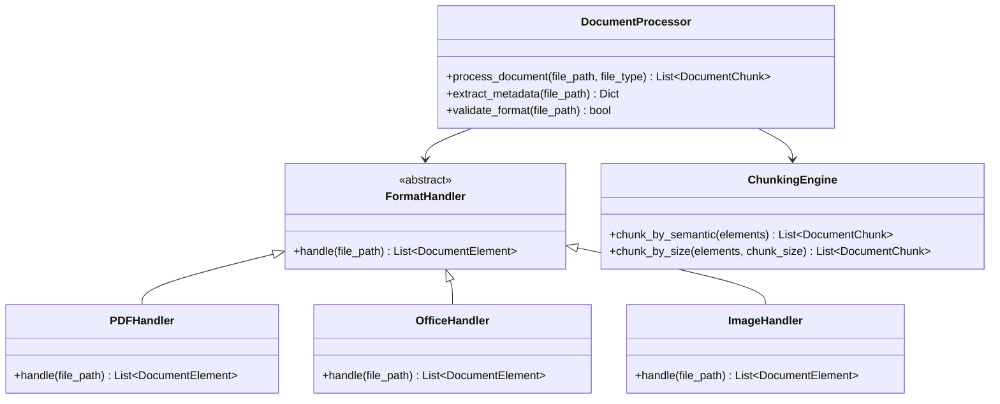
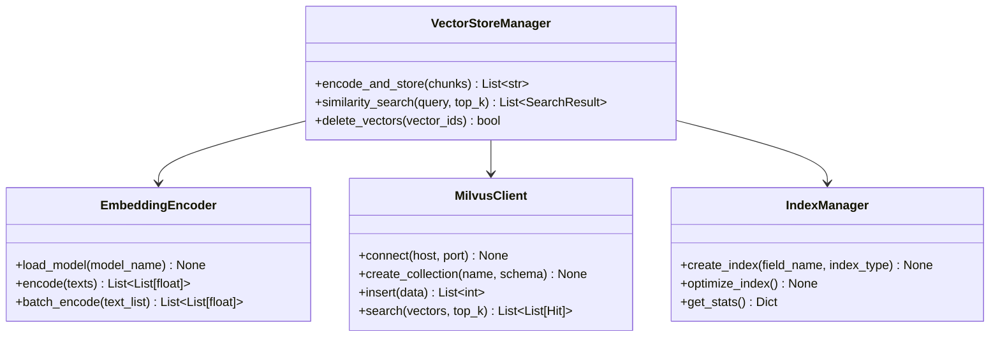
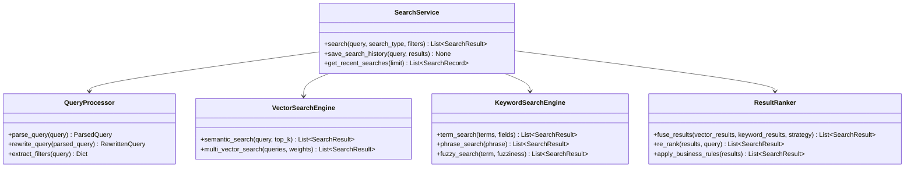
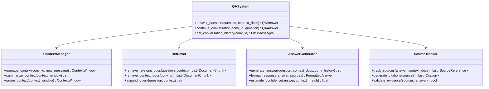
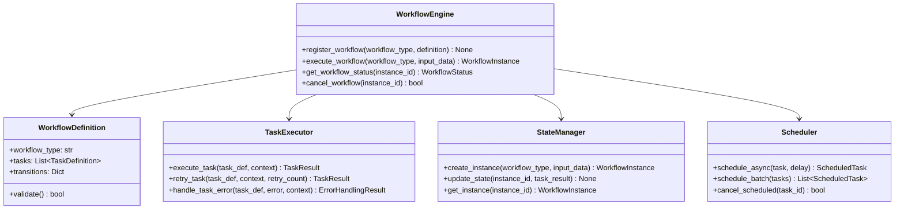

# AskMe 知识库系统功能设计文档

## 1. 系统概述

### 1.1 项目目标
构建一个完全本地化的知识库管理系统，支持多格式文档处理、智能检索和知识问答功能。

### 1.2 核心特性
- **完全本地化**：所有服务均可离线运行，无需外部API依赖
- **多格式支持**：支持40+种文档格式处理
- **智能OCR**：集成GLM-OCR处理图片文字
- **向量检索**：基于Milvus的语义搜索能力
- **工作流引擎**：可扩展的业务流程处理

## 2. 系统架构设计

### 2.1 四层架构
```
┌─────────────────────────────────────┐
│           展示层 (前端)              │
│  React + TypeScript + Ant Design    │
└─────────────────────────────────────┘
                │
┌─────────────────────────────────────┐
│         数据处理层 (核心)            │
│  unstructured + GLM-OCR + 分块处理   │
└─────────────────────────────────────┘
                │
┌─────────────────────────────────────┐
│       向量化与检索层 (存储)          │
│    Milvus + Elasticsearch + FAISS    │
└─────────────────────────────────────┘
                │
┌─────────────────────────────────────┐
│        业务工作流层 (应用)           │
│    文档问答 + 知识抽取 + 多轮对话    │
└─────────────────────────────────────┘
```

### 2.2 技术选型
| 层级 | 技术栈 | 选型理由 |
|------|--------|----------|
| 前端 | React 18 + TypeScript + Ant Design | 现代化框架，组件丰富 |
| 后端 | Python 3.10 + FastAPI | 高性能异步框架 |
| 数据库 | PostgreSQL + Redis | 关系型+缓存组合 |
| 向量存储 | Milvus (Zilliz) | 专业的向量数据库 |
| 搜索引擎 | Elasticsearch | 成熟的全文检索 |
| 文档处理 | unstructured | 开源项目，格式支持广泛 |
| OCR处理 | GLM-OCR | 您指定的技术方案 |
| 嵌入模型 | sentence-transformers | 本地运行，性能良好 |

## 3. 核心模块详细设计

### 3.1 文档处理模块

#### 3.1.1 功能描述
负责将各种格式的文档转换为结构化文本，支持智能分块和元数据提取。

#### 3.1.2 类图设计


#### 3.1.3 接口定义
```python
class DocumentProcessor:
    def process_document(self, file_path: str, file_type: str) -> List[DocumentChunk]:
        """
        处理文档并返回文本块列表
        
        Args:
            file_path: 文档路径
            file_type: 文件类型
            
        Returns:
            List[DocumentChunk]: 处理后的文本块列表
        """
        pass
    
    def extract_metadata(self, file_path: str) -> Dict[str, Any]:
        """
        提取文档元数据
        
        Returns:
            包含作者、创建时间、页数等信息的字典
        """
        pass

class DocumentChunk:
    def __init__(self, content: str, metadata: Dict, chunk_id: str):
        self.content = content
        self.metadata = metadata
        self.chunk_id = chunk_id
        self.source_document = metadata.get('source')
        self.position = metadata.get('position')

class DocumentElement:
    def __init__(self, content: str, element_type: str, position: int):
        self.content = content
        self.element_type = element_type  # title, paragraph, table, image等
        self.position = position
```

#### 3.1.4 处理流程
```
用户上传文档
    ↓
格式识别和验证
    ↓
选择对应的FormatHandler
    ↓
文档解析为DocumentElement列表
    ↓
ChunkingEngine进行智能分块
    ↓
生成DocumentChunk列表
    ↓
返回处理结果
```

### 3.2 向量存储模块

#### 3.2.1 功能描述
负责文本向量化编码、向量存储管理和相似度检索服务。

#### 3.2.2 架构设计


#### 3.2.3 数据结构
```python
class VectorStore:
    def __init__(self, model_name: str = "all-MiniLM-L6-v2"):
        self.encoder = EmbeddingEncoder(model_name)
        self.milvus_client = MilvusClient()
        self.index_manager = IndexManager()
        
    def encode_and_store(self, chunks: List[DocumentChunk]) -> List[str]:
        """
        编码文本块并存储向量
        
        Returns:
            List[str]: 向量ID列表
        """
        # 1. 提取文本内容
        texts = [chunk.content for chunk in chunks]
        
        # 2. 向量化编码
        embeddings = self.encoder.batch_encode(texts)
        
        # 3. 准备存储数据
        data = {
            "chunk_id": [chunk.chunk_id for chunk in chunks],
            "document_id": [chunk.metadata.get('document_id') for chunk in chunks],
            "embedding": embeddings,
            "content": texts
        }
        
        # 4. 存储到Milvus
        vector_ids = self.milvus_client.insert(data)
        return vector_ids
    
    def similarity_search(self, query: str, top_k: int = 10) -> List[SearchResult]:
        """
        执行语义相似度搜索
        """
        # 1. 查询向量化
        query_vector = self.encoder.encode([query])[0]
        
        # 2. Milvus搜索
        results = self.milvus_client.search([query_vector], top_k)
        
        # 3. 格式化结果
        formatted_results = []
        for hits in results:
            for hit in hits:
                formatted_results.append(SearchResult(
                    vector_id=hit.id,
                    content=hit.entity.get("content"),
                    similarity_score=self._convert_distance_to_similarity(hit.distance),
                    metadata={
                        "document_id": hit.entity.get("document_id"),
                        "chunk_id": hit.entity.get("chunk_id")
                    }
                ))
        
        return formatted_results

class SearchResult:
    def __init__(self, vector_id: str, content: str, 
                 similarity_score: float, metadata: Dict):
        self.vector_id = vector_id
        self.content = content
        self.similarity_score = similarity_score
        self.metadata = metadata
```

### 3.3 搜索服务模块

#### 3.3.1 功能描述
提供多类型搜索服务，包括关键词搜索、语义搜索和混合搜索。

#### 3.3.2 架构设计


#### 3.3.3 接口设计
```python
class SearchService:
    def __init__(self):
        self.query_processor = QueryProcessor()
        self.vector_engine = VectorSearchEngine()
        self.keyword_engine = KeywordSearchEngine()
        self.ranker = ResultRanker()
        
    async def search(self, query: str, search_type: str = "hybrid",
                    top_k: int = 10, filters: Dict = None) -> List[SearchResult]:
        """
        执行搜索操作
        
        Args:
            query: 搜索查询
            search_type: 搜索类型 ("keyword", "semantic", "hybrid")
            top_k: 返回结果数量
            filters: 过滤条件
            
        Returns:
            搜索结果列表
        """
        # 1. 查询预处理
        parsed_query = self.query_processor.parse_query(query)
        processed_filters = self.query_processor.extract_filters(query)
        if filters:
            processed_filters.update(filters)
        
        results = []
        
        # 2. 根据搜索类型执行不同策略
        if search_type in ["semantic", "hybrid"]:
            semantic_results = await self.vector_engine.semantic_search(
                parsed_query.text, top_k * 2
            )
            results.extend(semantic_results)
            
        if search_type in ["keyword", "hybrid"]:
            keyword_results = await self.keyword_engine.term_search(
                parsed_query.terms, ["content", "title"]
            )
            results.extend(keyword_results)
        
        # 3. 结果融合和排序
        if search_type == "hybrid":
            fused_results = self.ranker.fuse_results(
                semantic_results, keyword_results, strategy="rrf"
            )
            final_results = self.ranker.re_rank(fused_results, query)[:top_k]
        else:
            final_results = self.ranker.re_rank(results, query)[:top_k]
        
        # 4. 保存搜索历史
        await self.save_search_history(query, search_type, final_results)
        
        return final_results
    
    async def save_search_history(self, query: str, search_type: str, 
                                 results: List[SearchResult]) -> int:
        """
        保存搜索历史记录
        
        Returns:
            搜索记录ID
        """
        search_record = SearchRecord(
            query_text=query,
            search_type=search_type,
            result_count=len(results),
            timestamp=datetime.now(),
            results_summary=[{
                "content": r.content[:100],
                "score": r.similarity_score
            } for r in results[:3]]
        )
        
        # 保存到数据库
        record_id = await self._persist_search_record(search_record)
        return record_id

class SearchRequest:
    def __init__(self, query: str, search_type: str = "hybrid", 
                 top_k: int = 10, filters: Optional[Dict] = None):
        self.query = query
        self.search_type = search_type
        self.top_k = top_k
        self.filters = filters or {}

class SearchRecord:
    def __init__(self, query_text: str, search_type: str, result_count: int,
                 timestamp: datetime, results_summary: List[Dict]):
        self.query_text = query_text
        self.search_type = search_type
        self.result_count = result_count
        self.timestamp = timestamp
        self.results_summary = results_summary
```

### 3.4 问答系统模块

#### 3.4.1 功能描述
基于文档内容的智能问答系统，支持上下文管理和多轮对话。

#### 3.4.2 架构设计


#### 3.4.3 核心算法
```python
class QASystem:
    def __init__(self):
        self.context_manager = ContextManager()
        self.retriever = Retriever()
        self.generator = AnswerGenerator()
        self.tracker = SourceTracker()
        
    async def answer_question(self, question: str, 
                             context_docs: List[str] = None) -> QAAnswer:
        """
        回答问题的主要入口
        
        Args:
            question: 用户问题
            context_docs: 指定的上下文文档ID列表
            
        Returns:
            QAAnswer对象包含答案和相关信息
        """
        # 1. 创建新的对话ID
        conversation_id = self._generate_conversation_id()
        
        # 2. 检索相关文档
        if context_docs:
            relevant_docs = await self._get_specific_docs(context_docs)
        else:
            relevant_docs = await self.retriever.retrieve_relevant_docs(question)
        
        # 3. 构建上下文窗口
        context_window = self.context_manager.manage_context(
            conversation_id, Message("user", question)
        )
        
        # 4. 生成答案
        expanded_query = self.retriever.expand_query(question, context_window.history)
        raw_answer = await self.generator.generate_answer(
            expanded_query, relevant_docs, context_window.history
        )
        
        # 5. 格式化响应
        formatted_answer = self.generator.format_response(raw_answer, relevant_docs)
        
        # 6. 跟踪来源
        sources = self.tracker.track_sources(raw_answer, relevant_docs)
        citations = self.tracker.generate_citations(sources)
        
        # 7. 评估置信度
        confidence = self.generator.estimate_confidence(raw_answer, relevant_docs)
        
        # 8. 保存对话历史
        await self._save_conversation_step(
            conversation_id, question, formatted_answer.answer, sources
        )
        
        return QAAnswer(
            answer=formatted_answer.answer,
            confidence=confidence,
            sources=citations,
            context_used=[doc.chunk_id for doc in relevant_docs],
            conversation_id=conversation_id,
            reasoning_chain=formatted_answer.reasoning_steps
        )
    
    async def continue_conversation(self, conversation_id: str, 
                                   new_question: str) -> QAAnswer:
        """
        继续已有对话
        """
        # 1. 获取对话历史
        history = await self.get_conversation_history(conversation_id)
        
        # 2. 管理上下文窗口
        context_window = self.context_manager.manage_context(
            conversation_id, Message("user", new_question)
        )
        
        # 3. 检索相关文档（考虑历史上下文）
        relevant_docs = await self.retriever.retrieve_relevant_docs(
            new_question, context_window.history
        )
        
        # 4. 生成延续性答案
        answer = await self.generator.generate_answer(
            new_question, relevant_docs, context_window.history
        )
        
        # 5. 后续处理同上...
        return self._process_answer(answer, relevant_docs, conversation_id)

class QAAnswer:
    def __init__(self, answer: str, confidence: float, sources: List,
                 context_used: List[str], conversation_id: str,
                 reasoning_chain: List[str] = None):
        self.answer = answer
        self.confidence = confidence
        self.sources = sources
        self.context_used = context_used
        self.conversation_id = conversation_id
        self.reasoning_chain = reasoning_chain or []
        self.timestamp = datetime.now()

class ContextWindow:
    def __init__(self, max_tokens: int = 4000):
        self.messages: List[Message] = []
        self.max_tokens = max_tokens
        self.current_tokens = 0
        
    def add_message(self, message: Message):
        """添加消息并管理token数量"""
        message_tokens = self._count_tokens(message.content)
        if self.current_tokens + message_tokens > self.max_tokens:
            self._prune_messages()
        self.messages.append(message)
        self.current_tokens += message_tokens
    
    def _prune_messages(self):
        """移除早期消息以控制token数量"""
        # 保留系统消息和最近的几轮对话
        if len(self.messages) > 4:
            # 移除中间的消息，保留开始和结束的部分
            self.messages = [self.messages[0]] + self.messages[-3:]
```

### 3.5 工作流引擎模块

#### 3.5.1 功能描述
可扩展的工作流执行引擎，支持不同业务场景的流程自动化。

#### 3.5.2 架构设计


#### 3.5.3 工作流定义
```python
class WorkflowEngine:
    def __init__(self):
        self.registry = {}
        self.state_manager = StateManager()
        self.task_executor = TaskExecutor()
        self.scheduler = Scheduler()
        
    def register_workflow(self, workflow_type: str, definition: WorkflowDefinition):
        """注册工作流定义"""
        if not definition.validate():
            raise ValueError(f"Invalid workflow definition for {workflow_type}")
        self.registry[workflow_type] = definition
        
    async def execute_workflow(self, workflow_type: str, 
                              input_data: Dict) -> WorkflowInstance:
        """执行工作流"""
        if workflow_type not in self.registry:
            raise ValueError(f"Unknown workflow type: {workflow_type}")
            
        definition = self.registry[workflow_type]
        
        # 1. 创建工作流实例
        instance = self.state_manager.create_instance(workflow_type, input_data)
        
        # 2. 执行任务
        context = WorkflowContext(instance.id, input_data)
        
        try:
            for task_def in definition.tasks:
                # 执行任务
                task_result = await self.task_executor.execute_task(task_def, context)
                
                # 更新状态
                self.state_manager.update_state(instance.id, task_result)
                
                # 检查任务结果
                if not task_result.success:
                    if task_def.retry_policy:
                        # 重试逻辑
                        await self._handle_retry(task_def, context, instance)
                    else:
                        # 任务失败，终止工作流
                        instance.status = "failed"
                        instance.error_message = task_result.error_message
                        break
                        
                # 更新上下文
                context.update_from_result(task_result)
                
            # 工作流完成
            if instance.status != "failed":
                instance.status = "completed"
                instance.output_data = context.final_output
                
        except Exception as e:
            instance.status = "failed"
            instance.error_message = str(e)
            
        finally:
            # 保存最终状态
            await self.state_manager.save_instance(instance)
            
        return instance

class WorkflowDefinition:
    def __init__(self, workflow_type: str, tasks: List[TaskDefinition],
                 transitions: Dict = None):
        self.workflow_type = workflow_type
        self.tasks = tasks
        self.transitions = transitions or {}
        
    def validate(self) -> bool:
        """验证工作流定义的有效性"""
        # 检查任务依赖关系
        task_names = {task.name for task in self.tasks}
        
        for task in self.tasks:
            # 检查依赖的任务是否存在
            for dependency in task.dependencies:
                if dependency not in task_names:
                    return False
                    
        return True

class TaskDefinition:
    def __init__(self, name: str, task_type: str, config: Dict,
                 dependencies: List[str] = None, retry_policy: Dict = None):
        self.name = name
        self.task_type = task_type
        self.config = config
        self.dependencies = dependencies or []
        self.retry_policy = retry_policy or {"max_retries": 0, "delay": 0}

class WorkflowInstance:
    def __init__(self, instance_id: str, workflow_type: str, input_data: Dict):
        self.id = instance_id
        self.workflow_type = workflow_type
        self.input_data = input_data
        self.status = "pending"  # pending, running, completed, failed
        self.output_data = {}
        self.start_time = datetime.now()
        self.end_time = None
        self.error_message = None
        self.execution_log = []

class WorkflowContext:
    def __init__(self, instance_id: str, initial_data: Dict):
        self.instance_id = instance_id
        self.data = initial_data.copy()
        self.intermediate_results = {}
        self.final_output = {}
        
    def update_from_result(self, task_result: TaskResult):
        """根据任务结果更新上下文"""
        self.intermediate_results[task_result.task_name] = task_result.output
        self.data.update(task_result.output)
        
    def get_variable(self, key: str, default=None):
        """获取上下文变量"""
        return self.data.get(key, default)
```

## 4. 数据模型设计

### 4.1 数据库表结构

#### 4.1.1 文档表 (documents)
```sql
CREATE TABLE documents (
    id SERIAL PRIMARY KEY,
    filename VARCHAR(255) NOT NULL,
    file_path VARCHAR(500) NOT NULL,
    file_size INTEGER NOT NULL,
    mime_type VARCHAR(100) NOT NULL,
    status VARCHAR(50) DEFAULT 'uploaded',
    created_at TIMESTAMP DEFAULT CURRENT_TIMESTAMP,
    updated_at TIMESTAMP DEFAULT CURRENT_TIMESTAMP,
    metadata JSONB
);
```

#### 4.1.2 文档块表 (document_chunks)
```sql
CREATE TABLE document_chunks (
    id SERIAL PRIMARY KEY,
    document_id INTEGER REFERENCES documents(id),
    chunk_index INTEGER NOT NULL,
    content TEXT NOT NULL,
    embedding TEXT,  -- 存储向量的JSON字符串
    metadata JSONB,
    created_at TIMESTAMP DEFAULT CURRENT_TIMESTAMP
);
```

#### 4.1.3 搜索记录表 (search_results)
```sql
CREATE TABLE search_results (
    id SERIAL PRIMARY KEY,
    query_text TEXT NOT NULL,
    search_type VARCHAR(50) NOT NULL,
    results JSONB,
    created_at TIMESTAMP DEFAULT CURRENT_TIMESTAMP
);
```

#### 4.1.4 工作流实例表 (workflow_instances)
```sql
CREATE TABLE workflow_instances (
    id SERIAL PRIMARY KEY,
    workflow_type VARCHAR(100) NOT NULL,
    status VARCHAR(50) DEFAULT 'pending',
    input_data JSONB,
    output_data JSONB,
    created_at TIMESTAMP DEFAULT CURRENT_TIMESTAMP,
    updated_at TIMESTAMP DEFAULT CURRENT_TIMESTAMP
);
```

## 5. API接口设计

### 5.1 文档管理API
```
POST   /api/documents/upload          # 上传文档
GET    /api/documents/{id}            # 获取文档信息
GET    /api/documents                 # 列出文档
DELETE /api/documents/{id}            # 删除文档
```

### 5.2 搜索API
```
POST   /api/search                    # 执行搜索
GET    /api/search/history            # 获取搜索历史
GET    /api/search/suggestions        # 获取搜索建议
```

### 5.3 问答API
```
POST   /api/qa/ask                    # 提问
POST   /api/qa/conversation/{id}      # 继续对话
GET    /api/qa/conversations          # 获取对话列表
```

### 5.4 工作流API
```
POST   /api/workflow/execute          # 执行工作流
GET    /api/workflow/instances        # 列出工作流实例
GET    /api/workflow/types            # 获取可用工作流类型
```

## 6. 性能优化策略

### 6.1 文档处理优化
- 异步处理大文档
- 批量处理多个文档
- 缓存常用处理结果
- 内存映射大文件

### 6.2 搜索性能优化
- 向量索引优化
- 查询缓存机制
- 结果预加载
- 并行搜索执行

### 6.3 系统整体优化
- 数据库连接池
- Redis缓存层
- CDN静态资源
- 负载均衡配置

## 7. 安全设计

### 7.1 数据安全
- 文档加密存储
- 访问权限控制
- 敏感信息脱敏
- 审计日志记录

### 7.2 系统安全
- API认证授权
- 输入验证过滤
- 防止SQL注入
- XSS防护措施

## 8. 部署架构

### 8.1 开发环境
- Docker Compose编排
- 本地开发调试
- 热重载支持

### 8.2 生产环境
- Kubernetes集群部署
- 自动扩缩容
- 监控告警系统
- 备份恢复机制

## 9. 测试策略

### 9.1 单元测试
- 各模块独立测试
- 边界条件覆盖
- 异常情况处理

### 9.2 集成测试
- 模块间接口测试
- 数据流完整性
- 性能基准测试

### 9.3 端到端测试
- 用户场景模拟
- 系统稳定性验证
- 兼容性测试

## 10. 监控和运维

### 10.1 系统监控
- 服务健康检查
- 性能指标收集
- 错误日志分析
- 资源使用监控

### 10.2 运维工具
- 自动化部署脚本
- 配置管理工具
- 日志分析平台
- 故障诊断工具